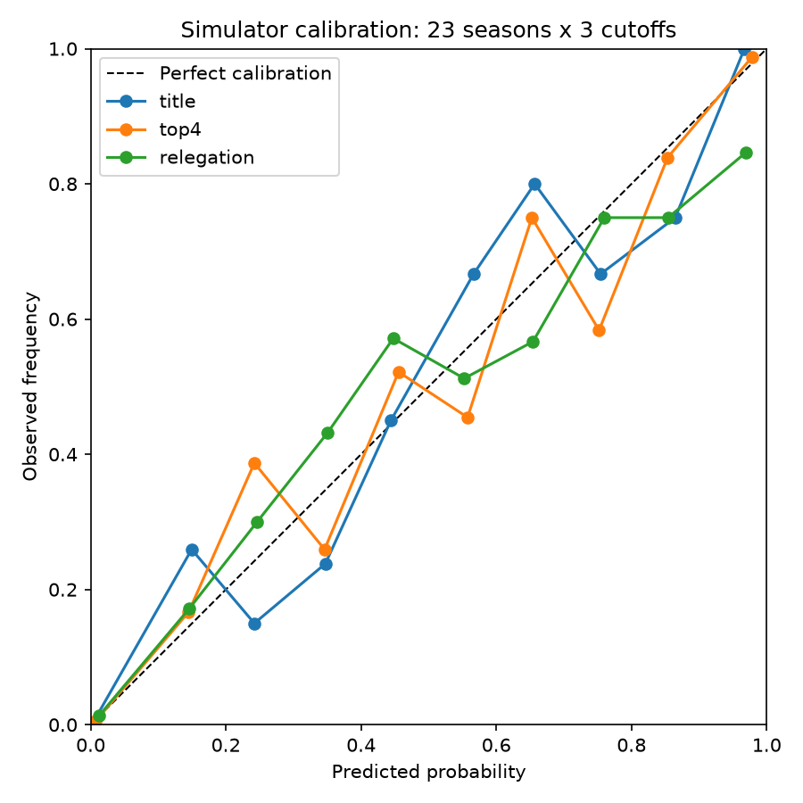

# Premier League Probabilistic Forecast & Monte Carlo Season Simulator

A probabilistic machine-learning system for forecasting Premier League match
outcomes and simulating full seasons: dynamic team-strength ratings (Elo),
statistical and ML goal/outcome models (Poisson, Dixon-Coles, logistic
regression, XGBoost), calibration-focused evaluation with time-based
backtesting, and a vectorized Monte Carlo season simulator producing
title/top-4/relegation probabilities.

This is a portfolio/educational project. Every model output is a
probabilistic forecast, not a prediction of what *will* happen — football is
highly stochastic, and the system is built and evaluated on that premise.

## Project status

🚧 **All 12 originally-planned phases done, plus two follow-on phases added afterward.** See the roadmap below.

- [x] Phase 1 — Data ingestion & cleaning
- [x] Phase 2 — Feature engineering (Elo, rolling form, league context)
- [x] Phase 3 — Baselines & evaluation infrastructure (log loss/Brier/RPS, expanding-window backtest)
- [x] Phase 4 — Poisson / Dixon-Coles goal model
- [x] Phase 5 — Logistic regression (Model 2, curated feature set)
- [x] Phase 6 — XGBoost (Model 4) + feature-importance explainability
- [x] Phase 7 — Calibration analysis (reliability diagrams)
- [x] Phase 8 — Monte Carlo simulation engine
- [x] Phase 9 — Current-season forecast (live data refresh)
- [x] Phase 10 — Hyperparameter tuning
- [x] Phase 11 — API (FastAPI)
- [x] Phase 12 — Frontend dashboard (React)
- [x] Phase 13 — Simulation calibration backtest
- [x] Phase 14 — Live deployment (Docker + Render + Vercel)

## Data

### Source

The natural primary source for this kind of project is
[football-data.co.uk](https://www.football-data.co.uk), which publishes one
CSV per English football division per season (Premier League = "E0") back to
1993-94, including match odds and, from 2000-01 onward, shots/corners/cards.

**That source is currently unreachable from this project's development
environment.** Connection attempts fail at the TLS handshake stage across
four independent client stacks (Windows schannel/curl, .NET/PowerShell,
Python+OpenSSL with relaxed cipher settings, and a server-side fetch
service), while other HTTPS hosts succeed without issue. That pattern points
to the site itself being down or blocking automated clients right now, not a
local network problem — but it means the pipeline can't be built and tested
against it today.

**Operational source: three combined sources**, since no single one covers
1993-94 through the present:

1. [`irkaal/english-premier-league-results`](https://www.kaggle.com/datasets/irkaal/english-premier-league-results)
   (Kaggle) — mirrors football-data.co.uk's own E0 files. Used only for its
   1993-94..1999-00 seasons.
2. [`marcohuiii/english-premier-league-epl-match-data-2000-2025`](https://www.kaggle.com/datasets/marcohuiii/english-premier-league-epl-match-data-2000-2025)
   (Kaggle) — a newer, more complete mirror, 2000-01..2024-25 (slightly
   truncated near the very end).
3. [`openfootball/football.json`](https://github.com/openfootball/football.json)
   (GitHub, public domain, **no API key required**) — fills the 2025-26 gap
   neither Kaggle source covers, and is also the **live source for the
   current season** (Phase 9), since it publishes the full fixture list with
   results filled in as matches are played.

If football-data.co.uk becomes reachable again, only `src/data/ingest.py`
and `configs/data.yaml` need to change — everything from
`src/data/validate.py` onward consumes whatever files land in each source's
raw directory, regardless of where they came from.

**Two other Kaggle datasets were checked and rejected as the 2025-26
source** before openfootball was found: one claimed full-season coverage but
had real results for only 3 of 38 matchweeks despite listing a full-season
date range (a fixture-list-only upload, never updated after the season
started); another was periodic table snapshots, not match-level results.
Both were verified by actually downloading and inspecting them, not by
trusting their descriptions.

### Seasons and coverage

**33 seasons, 1993-94 through 2025-26, 12,704 matches — the full available
history through the most recently completed season, with zero data-completeness
warnings.** Match counts per season exactly match known Premier League
history: 462 matches/season for the 22-team era (1993-94, 1994-95), 380
every season since. `src/data/validate.py::merge_sources` combines the three
sources **per season**, keeping whichever source has the most complete data
for that specific season, not simply whichever source is newest overall —
see "Data quality issues found and fixed" below for why that distinction
mattered in practice. `src/data/validate.py::cross_validate_overlap` checks
every pair of sources against each other wherever their seasons overlap: **0
score disagreements across 8,549 overlapping matches** (8,199 between the two
Kaggle sources, 350 between the newer Kaggle source and openfootball's
2024-25 file) — strong independent confirmation of data quality.

### Variables available

Every match has: `Date`, `HomeTeam`, `AwayTeam`, `FTHG`/`FTAG` (full-time
goals), `FTR` (H/D/A). From 1993-94: half-time goals/result (`HTHG`/`HTAG`/
`HTR`) for most matches (924 rows across the earliest seasons lack it).
**From 2000-01 onward only:** referee, shots/shots-on-target, corners, fouls,
and cards (`HS`,`AS`,`HST`,`AST`,`HC`,`AC`,`HF`,`AF`,`HY`,`AY`,`HR`,`AR`) —
entirely absent (null) before 2000-01, matching football-data.co.uk's own
known history. These extended columns are preserved in the processed dataset
but are not part of the core model input set per the project's Step 1 scope
decision (see project plan discussion) — they're a possible future
extension, not core scope.

### Licensing

football-data.co.uk's terms permit personal, non-commercial, educational use
with attribution to the site. This project is portfolio/educational use
only, not a commercial product, and stays inside those terms; the Kaggle
mirror inherits the same restriction.

### Download, storage, and reproducibility

- `data/raw/` holds the untouched downloaded files (gitignored — regenerated
  by the ingestion script, never hand-edited, never committed).
- `data/processed/matches.parquet` holds the cleaned, canonicalized,
  chronologically-sorted dataset every downstream module reads. Also
  gitignored and regeneratable — the pipeline that produces it is what's
  committed, not its output.
- `data/external/team_name_map.csv` is a small, versioned seed list mapping
  known club-name aliases (e.g. "Man Utd" → "Manchester United") to a
  canonical name, since team naming isn't always consistent.

To reproduce from a clean clone:

```bash
pip install -r requirements.txt

# One-time: create a Kaggle API token at kaggle.com -> Settings -> API,
# and place kaggle.json at ~/.kaggle/kaggle.json (see src/data/ingest.py
# docstring for full instructions, including what to do if Kaggle's UI
# gives you a bare token string instead of a kaggle.json download).

python -m src.data.ingest      # downloads all 3 raw sources (2 Kaggle + openfootball)
python -m src.data.validate    # cleans, cross-validates, merges -> matches.parquet
pytest tests/                  # runs the full test suite
```

### Live updates (Phase 9)

The current in-progress season refreshes via the same
[openfootball/football.json](https://github.com/openfootball/football.json)
source used to fill the 2025-26 historical gap — no API key needed, unlike
the football-data.org integration originally planned here. It publishes the
full season's fixture list with results filled in as matches are played, so
`experiments/run_phase9_live_forecast.py` reads it directly for both "what's
happened so far" (current table state, via the same `LeagueTableTracker`
Phase 2's historical features use) and "what's left to play" (the
simulator's remaining-fixture input), kept entirely separate from the frozen
historical ingestion path (see `configs/data.yaml` → `live_source`). Unlike
every other raw source in this project, the live file is re-fetched on
every run rather than cached — it changes every time a match is played.

## Data quality issues found and fixed during Phase 1

Documented here deliberately, since catching and explaining exactly this
kind of issue is a core goal of this project (see "Avoid Data Leakage" /
data-validity principles in the project plan):

1. **Season-boundary bug (caught by an automated sanity check, not by
   manual inspection).** The initial season-assignment rule used "month ≥ 7"
   as the cutover into a new season. The COVID-disrupted 2019-20 season
   actually finished in late July 2020 (matches played behind closed doors
   to complete the fixture list). The July cutover misfiled those ~66
   trailing matches into "2020-21", inflating that season to 446 matches /
   23 implied teams instead of the correct 380/20. Fixed by moving the
   cutover to August — the Premier League has never started a season before
   August, so this has no equivalent failure mode. A regression test
   (`test_covid_delayed_season_stragglers_stay_in_prior_season`) locks this
   in. See `src/data/validate.py::assign_season`.

2. **Date-parsing correctness depended on batch composition.** Letting
   pandas auto-guess the date format (`pd.to_datetime(..., dayfirst=True)`,
   with or without `format="mixed"`) resolves day/month ambiguity in ISO
   8601 strings by scanning the array for *some* row unambiguous enough to
   lock in a format, then applying that format to the whole batch. A batch
   containing only ambiguous rows (every date component ≤ 12) silently
   misparses e.g. `"1993-09-01T00:00:00Z"` as 9 Jan instead of 1 Sep — and
   because correctness depended on which other rows happened to share the
   batch, this is exactly the kind of bug that would resurface on a small
   incremental live-data update (Phase 7) even though it "worked" on the
   full historical file. Fixed by detecting ISO input explicitly (the "T"
   separator) and parsing each format with an explicit rule rather than
   guessing. See `src/data/validate.py::parse_dates` and the
   `TestParseDates` tests.

3. **"Prefer the newer source" was the wrong merge rule.** When the
   historical dataset was later expanded to 3 sources (Phase 9 prep — see
   "Seasons and coverage" above), the first version of `merge_sources`
   picked, for any season two sources both covered, whichever source was
   listed later (generally newer/more complete). That's wrong: the newer,
   generally-more-complete 2000-2025 Kaggle source turned out to be missing
   45 matches each for specifically 2003-04 and 2004-05 (335/380), seasons
   the older 1993-2000 source has completely (380/380) — caught immediately
   by the same per-season match-count sanity check from bug #1, applied to
   the newly-merged data. Fixed by choosing per season based on actual match
   count, not source recency, with source order only breaking an exact tie.
   Regression tests lock in both directions (`TestMergeSources`).

4. **Adding a new source silently split a club's history in two.** The same
   expansion introduced "Leicester City FC" and "Southampton FC" as team
   names distinct from the already-canonical "Leicester City" and
   "Southampton" — the new source's naming convention wasn't covered by
   `team_name_map.csv`, which had only been built against the sources known
   at the time. First surfaced as an anomaly in an Elo sanity check (two
   unfamiliar-looking teams in the bottom-5 ratings), not by manual
   inspection of the 53-line team list, which is exactly why
   `sanity_check` now runs `find_near_duplicate_team_names` automatically
   on every build rather than relying on someone reading the printed list
   closely enough to notice two names that differ only by a trailing "FC".

All four were caught by the pipeline's own automated checks — per-season
match-count validation, cross-checking the derived `Season` column against
the source's own `Season` column (0 mismatches), and now automated
near-duplicate team-name detection — not by assuming the data or the code
was correct.

## Feature engineering (Phase 2)

`src/features/build_dataset.py` assembles `data/processed/features.parquet`
(12,704 rows × 77 columns as of the current, post-Phase-9-backfill dataset —
11,113 × 76 when this phase was first built, before the historical data was
expanded to 2025-26) from `matches.parquet`, combining three
independent feature sources - each leakage-tested on its own:

- **Elo ratings** (`src/features/elo.py`) - one overall rating per team,
  updated sequentially match-by-match, with a home-advantage constant, an
  optional goal-margin multiplier, season-boundary regression toward the
  mean, and a mean-minus-penalty starting rating for teams with no prior
  history. See the module docstring for the full mathematical explanation
  and design rationale (including why this uses one rating track per team
  rather than separate home/away tracks).
- **Rolling form** (`src/features/rolling.py`) - 3/5/10-match rolling
  goals-for/against, points-per-game, and win/draw rate per team, plus
  rest-days-since-last-match and relative attack-vs-defence "matchup"
  features, all computed with a rolling-then-shift pattern so a match's
  features reflect only strictly prior matches.
- **League table state** (`src/features/league_table.py`) - pre-match
  points, goal difference, games played, and table position, reset every
  season. Position is intentionally computed with a same-date-batched
  sequential pass rather than a vectorized cumsum: this dataset only
  records a match's date (not kickoff time), so two matches sharing a date
  must see an identical pre-match snapshot regardless of row order - a
  row-by-row update would let one same-day match's result leak into
  another same-day match's position feature. See the module docstring and
  `test_league_table.py::test_same_date_matches_see_identical_snapshot`.

**Sanity check against real data:** the final rows of the feature matrix
(matches from April 2022, the end of this dataset) show Manchester City on
73 points in 1st and Liverpool on 72 points in 2nd - recovering, purely
from raw match results, the historically famous single-point-margin
2021-22 title race.

**A second real bug was found and fixed the same way as Phase 1** - by a
unit test, not by inspection: in `EloRatingSystem`, the very first match of
the entire dataset gave the away team a "newly promoted" rating penalty
instead of the initial rating. The home team's lookup inserted into the
ratings dict first, so by the time the away team was checked a moment
later in the same match, the dict no longer looked empty. Fixed by
snapshotting "does the league have any ratings yet" once per match, before
either side is looked up - see `src/features/elo.py::EloRatingSystem.
process_match` and the regression test in `test_elo.py`.

202 tests pass across the full suite (`pytest tests/`), all against
synthetic data - no test depends on the downloaded dataset being present.
(This count was 68 as of Phase 2; Phases 3-11 added the metrics, baseline,
Elo-outcome, backtest, Poisson/Dixon-Coles, logistic-regression, XGBoost,
calibration, simulation-engine/summary, multi-source data-merge,
hyperparameter-tuning, API, and background-refresh-cache tests.)

## Model evaluation (Phase 3)

**Why not select models by accuracy?** Accuracy only asks "was the top
pick right" - it's blind to *how confident* a model was, which is exactly
what the Monte Carlo simulator (Phase 7) will need to sample from
honestly. Concretely: "always predict home win" scores **45.8% accuracy**
on this dataset - deceptively close to far more sophisticated models -
purely because home win is the single most common outcome in football
(~46% of matches historically). This project selects and compares models
on **log loss, Brier score, and RPS** (see `src/evaluation/metrics.py` for
the full mathematical explanation of each), with accuracy reported only
for interpretability.

**Backtesting methodology:** `src/evaluation/backtest.py` implements
expanding-window, season-by-season backtesting - train on the first 10
seasons (1993-94 → 2002-03), predict 2003-04, retrain including 2003-04,
predict 2004-05, and so on through 2021-22 (19 held-out seasons). Every
metric below is a **match-count-weighted average across all 19 seasons**,
never a single lucky/unlucky split.

### Model comparison (Phases 3-5)

> **Note:** the numbers below (and the Phase 6-7 XGBoost/calibration results
> further down) were computed on the 29-season dataset (1993-94..2021-22),
> before Phase 9 expanded the historical data to 33 seasons through 2025-26.
> They haven't been recomputed on the larger dataset — re-running the
> backtests is possible (`python -m experiments.run_phase6_xgboost` etc.
> against the current `features.parquet`) but wasn't treated as required
> for Phase 9, since the live forecast fits its own model fresh on the full
> current historical dataset regardless of what these tables say. The
> qualitative conclusions (Elo edges out the others; XGBoost underperforms;
> calibration ranking differs from log-loss ranking) are unlikely to flip
> from 4 additional seasons, but the exact decimal values here predate them.

| Model | Log Loss | Brier | RPS | Accuracy |
|---|---|---|---|---|
| Baseline (historical frequency) | 1.0651 | 0.6434 | 0.2281 | 45.70% |
| **Elo** (`elo_diff` → multinomial logit) | **0.9825** | **0.5850** | **0.1999** | **53.07%** |
| Poisson (independent) | 0.9891 | 0.5894 | 0.2021 | 52.57% |
| Poisson (Dixon-Coles) | 0.9890 | 0.5893 | 0.2020 | 52.54% |
| Logistic Regression (11 features) | 0.9848 | 0.5855 | 0.2000 | 53.03% |
| XGBoost (~50 features) | 0.9907 | 0.5898 | 0.2017 | 52.22% |

Both Elo and Poisson clear the baseline by a wide, consistent margin (every
metric, nearly every individual season - see `experiments/results.csv`).
Between Elo and Poisson, the picture is closer and worth reporting
honestly rather than declaring a winner:

- **Elo wins on every aggregate metric**, but only **narrowly** - and only
  **12 of the 19** individual held-out seasons; Poisson (Dixon-Coles) wins
  outright in the other **7**, including several recent seasons
  (2018-19, 2020-21, 2021-22). This is a real, close competition between
  two very different modeling approaches, not a rout.
- **The Dixon-Coles correlation adjustment barely moves the needle** here
  (log loss 0.98910 → 0.98904, a ~0.006% relative change), even though the
  fitted `rho` (~ -0.04) is in a sensible, literature-consistent range.
  The low-score correlation effect Dixon & Coles documented appears to be
  real but small enough, once averaged over a full season of matches
  varied in scoreline, to barely register in season-level log loss - worth
  knowing before assuming the added complexity is "obviously" earning its
  keep.
- Neither model's hyperparameters have been tuned yet (Elo's `k_factor`/
  `home_advantage`/`season_shrinkage`; Poisson's `xi`/`promoted_penalty`
  time-decay and promoted-team settings) - both are running on
  literature-typical defaults, not values fit to this data. Closing that
  gap is future work, not a claim that the current ranking is final.
- **Log loss alone doesn't settle which model belongs in this project.**
  Poisson gives something Elo structurally cannot: actual expected-goals
  numbers and a full scoreline probability grid (`predict_expected_goals`,
  `predict_score_grid`) - needed for the "expected goals: 1.72 / 1.31" and
  "most likely scorelines" match-prediction output the project plan calls
  for, and useful groundwork for sampling realistic scorelines in the
  Monte Carlo simulator, not just a W/D/L outcome. Every model here exists
  for a reason beyond "wins on log loss" - this is why Poisson stays in
  the comparison even where Elo currently edges it out.

Reproduce with `python -m experiments.run_phase6_xgboost` (supersedes
earlier phase experiment scripts with the same result files, now including
XGBoost and its feature-importance report).

**Model 1 (Elo) design note:** rather than hand-picking a fixed formula to
split Elo's two-outcome "expected score" into three W/D/L probabilities,
`src/models/elo_model.py` fits a multinomial logistic regression with
`elo_diff` as its only input - effectively just calibrating a rating gap
into a probability triple (~4 free parameters), refit fresh on each
backtest fold's training window. See the module docstring for the full
reasoning, including why this is kept deliberately simpler than Model 2
(logistic regression with many features, Phase 5).

**Model 3 (Poisson/Dixon-Coles) design notes:**
`src/models/poisson_model.py` fits per-team attack/defense strength
parameters (Maher, 1982) via maximum likelihood, with an optional
Dixon-Coles (1997) low-score correlation correction. Two implementation
details worth knowing about:
- **Two-stage fitting for speed.** A first pass tried optimizing all ~100
  parameters (attack/defense/home-advantage/rho) jointly via generic
  numerical-gradient optimization - correct, but **60-114 seconds per
  fit** at this dataset's largest training window, which would have made
  a 19-fold backtest impractically slow. Deriving and supplying an
  **analytical gradient** for the (dominant) independent-Poisson
  likelihood, then fitting `rho` separately in a second, fast 1-D search
  with attack/defense/home-advantage held fixed, cut that to **~0.4
  seconds** (~285x) with the fitted parameters essentially unchanged (rho
  -0.0392 → -0.0389, home-advantage 0.1938 → 0.1937) - confirming the
  two-stage simplification isn't costing meaningful accuracy.
- **Identifiability.** Attack/defense parameters are only determined up to
  a joint additive shift (raise every team's attack and defense together
  and every predicted score stays identical), so the model fixes one
  reference team's attack rating to 0 - see the module docstring for the
  full explanation and why this doesn't bias predictions.

**Model 2 (logistic regression) result - and why it matters more than the
table alone suggests:** `src/models/logistic_model.py` fits a multinomial
logistic regression over 11 curated features - `elo_diff`, recent-form and
attack/defense-matchup differentials (window=5), rest-days difference, and
pre-match table points/position/goal-difference for both teams (feature
list and the reasoning behind each choice are in the module docstring).
Despite eleven inputs against Elo's one, **it barely beats Elo alone**
(log loss 0.9848 vs. 0.9825 - Elo is still marginally ahead) and doesn't
beat it on accuracy at all. The standardized coefficients (also fit on the
full dataset and printed by `run_phase5_logistic.py`) explain why plainly:
`elo_diff`'s coefficient magnitude (~0.46-0.49) is roughly **2-40x larger**
than every other feature's (table points: 0.11-0.36; everything else,
including all three recent-form features, under 0.05). This is a genuine,
useful finding, not a disappointing one: it says Elo alone is already
capturing nearly all of the linearly-usable signal in this feature set,
and the richer feature engineering from Phase 2 mostly *isn't* adding
independent predictive value on top of it, at least not in a form a linear
model can exploit. Two things this does NOT rule out, and that Phase 6
(XGBoost) is specifically positioned to test: non-linear interactions
between features (e.g. "recent form matters more when Elo ratings are
close"), and interactions a purely additive linear model structurally
can't represent.

**Phase 6 (XGBoost) result - the hypothesis above did NOT hold up, and
that's the most important finding in this comparison table.**
`src/models/xgboost_model.py` gave gradient boosting the richest feature
set of any model here (~50 columns, all three rolling windows, NaN values
passed through natively rather than imputed - see the module docstring
for why a tree ensemble can use a broader, less-curated set than the
logistic model could). If the closeness between Elo/Poisson/logistic
regression really were "these three linear-ish models have hit a ceiling
that a model capable of non-linear interactions could break through,"
XGBoost should have been the clear winner. **It's actually the worst
performer among every non-baseline model** - log loss 0.9907, behind even
independent Poisson, and its accuracy (52.2%) is the lowest of the four
real models. Its own feature importances still rank `elo_diff` far above
everything else (gain 0.186 vs. 0.017-0.024 for the next dozen features -
see `run_phase6_xgboost.py` output / README "Explainability"), so it isn't
finding and exploiting some hidden interaction the linear models miss -
if anything, it's diluting Elo's strong, clean signal across a large
feature set on a comparatively small dataset (~7,000-10,000 training rows
per fold against ~50 features) with default, untuned hyperparameters,
which is precisely the overfitting failure mode gradient boosting is known
for at this data scale. This is exactly the outcome the project's stated
principle ("if a simpler approach performs better, tell you") exists to
surface rather than to paper over with a bigger model. It does NOT mean
XGBoost is a dead end - hyperparameter tuning (shallower/fewer trees,
stronger regularization) is untried and could change this - but as
currently built, it does not earn a place ahead of Elo in this project,
and that result is reported plainly rather than quietly dropped from the
comparison.

**Explainability (Phase 6):** for XGBoost, gain-based feature importance
(`XGBoostOutcomeModel.feature_importances()`) is reported rather than a
full SHAP analysis - per the project's own principle of not adding
explainability tooling without a clear reason, a deeper SHAP investigation
of dependence/interaction effects is deferred: it's most useful for
understanding a model that's actually earning its complexity, and right
now this one isn't. Worth revisiting if hyperparameter tuning changes that
picture. Logistic regression's standardized coefficients (reported above)
serve the equivalent role for that model - both explainability methods
here converge on the identical conclusion: `elo_diff` dominates every
other engineered feature by a wide margin.

## Calibration analysis (Phase 7)

**Why check this separately from log loss/Brier/RPS at all?** Those
metrics reward good calibration *on average*, but a model can post a
solid aggregate score while still being subtly miscalibrated in exactly
the probability range that matters most once it's driving 10,000+
simulated seasons (Phase 8). If a model says "70% chance of a home win"
across a group of matches but the true rate there is actually 55%, every
simulated season built from it quietly overstates how often that kind of
team wins - not by much in any one match, but compounded across a 38-game
season and thousands of simulated seasons, that turns into a materially
wrong title/relegation probability. `src/evaluation/calibration.py` checks
this directly: bin each model's predicted "home win" probability into
deciles, and compare the average prediction in each bin against the
actual observed home-win frequency there (a *reliability diagram*),
summarized by Expected Calibration Error (ECE) - full mathematical
explanation in the module docstring.

### Result: the calibration ranking is NOT the same as the log-loss ranking

| Model | ECE (home win) | (for reference) Log Loss rank |
|---|---|---|
| **Poisson (Dixon-Coles)** | **0.0156** | 3rd of 4 |
| XGBoost | 0.0185 | 4th of 4 |
| Logistic Regression | 0.0203 | 2nd of 4 |
| Elo | 0.0243 | **1st of 4** |

**Elo - the model with the best log loss - is the worst-calibrated of the
four**, specifically underconfident in its higher-confidence predictions:
in the 0.6-0.7 predicted-probability bin, Elo says ~64.6% but home wins
actually happen 69.4% of the time there (908 matches); in the 0.7-0.8 bin,
it says ~74.0% but the true rate is 79.4% (500 matches) - both sizeable
samples, not noise. Poisson (Dixon-Coles), despite a very slightly worse
log loss, tracks the diagonal much more closely across almost every bin.
All four models are reasonably well-calibrated in absolute terms (every
ECE is under 0.025 on a 0-1 scale) - this isn't "Elo is broken," it's "the
model that best minimizes average error isn't automatically the model
whose confidence levels can be trusted most literally," which is precisely
the distinction log loss alone can't surface and the reason this project
treats calibration as a separate, required check rather than assuming a
good log loss implies good calibration.

Full per-bin tables: `experiments/calibration_ece.csv`; reliability
diagram: `experiments/calibration_home_win.png`; reproduce with
`python -m experiments.run_phase7_calibration`.

**This is relevant to an earlier decision worth revisiting, not
overturning unilaterally:** the plan going into the Monte Carlo simulator
(Phase 8) was to default to Elo, since it has the best aggregate log
loss/Brier/RPS/accuracy, while keeping the simulator model-agnostic so any
model's probabilities can be swapped in. This calibration result doesn't
change the "keep it swappable" part, but it's a genuine trade-off worth
being aware of when picking the *default*: Elo's raw win/loss/draw
accuracy is best on average, but Poisson's probabilities are the most
literally trustworthy at any given confidence level - which is arguably
more important for a system whose whole output is "probability of X" at
scale. Worth a second look before finalizing which model the simulator
defaults to.

## Monte Carlo simulation engine (Phase 8)

`src/simulation/engine.py` turns a set of remaining fixtures' expected
goals into thousands of simulated final league tables in one pass: sample
every fixture's home/away goals for every simulation at once (two
vectorized `rng.poisson()` calls), convert to points, scatter-accumulate
each team's points/goals across every simulation with `np.add.at`, and
rank every simulation's final table with a single combined-integer
`argsort` (points → goal difference → goals scored, matching the real
Premier League order minus head-to-head - the same documented
simplification `src/features/league_table.py` uses for historical
features, and for the same reason: head-to-head isn't cleanly
vectorizable and almost never decides the outcomes this project reports).
`src/simulation/summary.py` turns that into the actual headline numbers:
title/Champions-League/relegation probability, expected position, and a
full points distribution per team, with European qualification cutoffs
configurable rather than hardcoded (the real UEFA rules are more complex
than a fixed cutoff and change year to year - this is a labeled
simplification, not a claim of exact accuracy).

**Design choice, and why:** as discussed above, this project's simulator
defaults to the Poisson/Dixon-Coles model specifically so it can sample
real scorelines (needed for goal-difference-aware standings and the
project's "Arsenal wins 2-1" style output) rather than just a W/D/L label.
Home and away goals are sampled **independently** from their marginal
Poisson distributions rather than jointly from the Dixon-Coles-adjusted
grid - a deliberate, quantified trade: joint sampling at 100,000
simulations × ~100 remaining fixtures × ~121 possible scorelines would
need well over a gigabyte of intermediate probability mass, for a
correlation effect Phase 4 already measured as barely moving aggregate
log loss (0.9891 → 0.9890). Full reasoning in the module docstring.

### Performance benchmark

| Simulations | Time | Throughput |
|---|---|---|
| 10,000 | 0.17s | ~57,000/sec |
| 50,000 | 0.86s | ~58,000/sec |
| 100,000 | 1.62s | ~62,000/sec |

(20-team league, ~100 remaining fixtures - a realistic mid-season
scenario.) Scales linearly, and 100,000 simulations in well under 2
seconds comfortably answers the project plan's question of whether that
scale is computationally reasonable.

### End-to-end validation against a real, fully-known season

Rather than only unit-testing the simulator's internal mechanics (which
`tests/test_simulation_engine.py` / `test_simulation_summary.py` do -
point assignment, valid-table invariants, reproducibility), the whole
pipeline was validated against a real season whose outcome is already
known: the **2020-21 season, frozen at a January 1, 2021 cutoff**. The
Poisson model was trained only on matches before that date (never seeing
the second half of the season), the current table was built from the 155
matches actually played by that point, and the remaining 225 fixtures
were simulated 20,000 times - exactly the shape Phase 9's live forecast
will eventually take, just checked against a season we already know the
answer to. Reproduce with `python -m experiments.run_phase8_simulation_validation`.

**Results**: Manchester City - the eventual champions - had by far the
highest simulated title probability (51.7%), roughly 1.5x Liverpool's
(35.5%) and 6.6x Manchester United's (7.8%). More strikingly, **all three
teams that were actually relegated that season** (Fulham, West Brom,
Sheffield United) were exactly the three teams with the highest simulated
relegation probabilities (77.7%, 83.7%, 91.6%) - not just "in the
relegation zone on average," but correctly ranked as the three most
likely relegation candidates specifically. The misses are informative
rather than concerning: West Ham's real second-half surge to a 6th-place
finish (expected position 11.3 from the model) is a well-documented
overperformance no pre-cutoff model could have seen coming, and
Liverpool's actual 69 points falling well short of their 77.3 expected
tracks their real, well-documented injury crisis that spring - exactly
the kind of genuine, irreducible football unpredictability this project's
probabilistic framing is built to represent honestly rather than paper
over with false certainty.

## Current-season live forecast (Phase 9)

`experiments/run_phase9_live_forecast.py` is the payoff of every earlier
phase working together: it fits the Poisson/Dixon-Coles model on the full
historical dataset (Phases 1-2) plus the current season's matches so far,
builds the current table state with the same tracker historical features
use, simulates the remaining season 50,000 times (Phase 8), and reports the
same headline statistics as the Phase 8 validation - except this time for
a season still being played, not one whose outcome is already known.

**Live result, as of 2026-08-31** (10 of 380 matches played):

| Team | Title % | Champions League % | Relegation % | Expected position |
|---|---|---|---|---|
| Manchester City | 65.4% | 99.0% | 0.0% | 1.5 |
| Arsenal | 21.6% | 92.8% | 0.0% | 2.5 |
| Liverpool | 10.9% | 84.9% | 0.0% | 3.2 |
| Chelsea | 1.3% | 42.2% | 0.1% | 5.7 |
| ... | | | | |
| Ipswich Town | 0.0% | 0.0% | 89.0% | 18.5 |
| Coventry City | 0.0% | 0.0% | 100.0% | 20.0 |

Full table: `experiments/live_forecast_2026_27.csv`. Reproduce with
`python -m experiments.run_phase9_live_forecast` (re-fetches the live file
and refits the model every run, so the numbers will differ - and should -
the next time a match is played).

**This is exactly the probabilistic framing the whole project is built
around** (see project plan discussion, "Don't claim the model is
correct"): Manchester City having a 65% simulated title probability is not
a claim that Manchester City will win the league. Ten matches into a
38-match season, that number mostly reflects Elo/Poisson ratings still
weighted heavily by *last* season's form - which is honest, not a flaw: a
well-calibrated forecast this early in a season should be uncertain, and
will keep updating automatically as more matches are played and re-fed
into the same pipeline. All three newly-promoted teams this season
(Coventry City, Hull City, Ipswich Town - confirmed by diffing this
season's team list against last season's) sit at the bottom with the
highest relegation probabilities - the same pattern the Phase 8 validation
found against a season whose real outcome was already known.

## Hyperparameter tuning (Phase 10)

Every model through Phase 9 ran on reasonable literature defaults, not
tuned values - flagged along the way but never closed until now.
`src/evaluation/tuning.py` implements nested validation: all 33 seasons
split chronologically into an initial training block (10 seasons), a
validation block used ONLY for tuning (5 seasons, 2003-04..2007-08), and a
final test block (18 seasons, 2008-09..2025-26) the tuning process never
sees - the same "no lucky/leaked split" guarantee the Phase 3 backtest
harness provides, applied one level up so hyperparameters aren't fit to the
same seasons used to report how good they are.

One implementation wrinkle worth understanding: Elo's hyperparameters
(`k_factor`, `home_advantage`, `season_shrinkage`, `promoted_team_penalty`)
aren't parameters of a model - they're parameters used to compute the
`elo_diff` FEATURE itself (Phase 2). Tuning them means regenerating that
feature per candidate value (`tune_elo_features`), not just refitting a
model against one fixed feature matrix, the way Poisson/logistic
regression/XGBoost's tuning (`tune_model`) does.

### Result: every model improved, and the ranking held

| Model | Default log loss | Tuned log loss | Δ |
|---|---|---|---|
| **Elo** | 0.9814 | **0.9771** | −0.0043 |
| Logistic Regression | 0.9782 | 0.9779 | −0.0003 |
| XGBoost | 0.9844 | 0.9814 | −0.0030 |
| Poisson (Dixon-Coles) | 0.9923 | 0.9861 | −0.0062 |

(All four measured on the same 18-season final test block, so this is a
fair like-for-like comparison - unlike the earlier "Model comparison"
table above, which used a different season split entirely and predates
Phase 9's historical data backfill.) **Elo still wins after every other
model gets tuned its own fair shot** (0.9771 vs. logistic regression's
0.9779) - a more robust version of the original "simple approach wins"
finding than the untuned comparison alone could support, since it rules
out "Elo only won because nobody bothered tuning the others" as an
explanation.

Selected tuned values: Elo's `home_advantage` moved up from 100 to 150 and
`season_shrinkage` moved down from 0.33 to **0** - the data disagreed with
this project's original hypothesis that regressing ratings toward the mean
between seasons would help, which is reported honestly rather than
re-justified after the fact (see `configs/elo.yaml` for the full
per-parameter reasoning). XGBoost's tuned configuration (400 trees,
learning rate 0.01, same depth-3 as before) is a much more heavily
regularized version of the original guess - consistent with Phase 6's
finding that XGBoost was likely overfitting.

### A real train/deploy mismatch, found and fixed

Applying Poisson's tuned hyperparameters (`xi=0.5`, faster recency decay)
to Phase 9's live forecast produced a visibly wrong result: **Hull City -
newly promoted, one match played, a single 2-0 win over Manchester United
- came out as the #2 title favorite at 30.7%, ahead of Arsenal.** The root
cause: Phase 10's tuning only ever validated *whole-season-ahead*
predictions (train on complete prior seasons, predict a complete season at
once); it never tested "predict the rest of a season after only 1-2
matchdays," which is exactly Phase 9's actual scenario. The faster recency
decay that helps when predicting a full season out overweights one
small-sample early-season result badly enough to make Hull City's fitted
defense parameter briefly look stronger than most of the league's -
confirmed directly by comparing their fitted attack/defense parameters
under both configurations (`experiments/run_phase9_live_forecast.py`'s
inline comment has the full diagnostic).

**Fixed by having Phase 9 explicitly use the original, more conservative
values (`xi=0.3`, `promoted_penalty=0.4`)** rather than inheriting the
class default - the same values Phase 8's validation (also a mid-season
cutoff) used and already confirmed sensible against a season with a known
real outcome. `src/models/poisson_model.py`'s docstring carries the same
warning for anyone else predicting early in a season with few matches
played. **Genuine, not-yet-done future work this discovery motivates**: a
dedicated mid-season-cutoff tuning pass - sweeping `xi` validated
specifically against partial-season predictions across many seasons and
cutoff points, the way Phase 8 checks the simulator's output but Phase 10
never checked the hyperparameters against that same scenario.

Reproduce with `python -m experiments.run_phase10_tuning` (takes a few
minutes - Elo/Poisson/logistic regression tune in seconds each, XGBoost's
25-candidate random search is the slow part at roughly 2 minutes, still
comfortably a laptop-scale job; see below for why Colab/GPU access isn't
needed for tuning on a dataset this size).

**Why not Google Colab for this?** Colab's real value is free GPU/TPU
access, which matters for GPU-bound workloads - deep learning, mainly. This
project deliberately has none of that (see Step 1 of the original project
plan discussion on why deep learning isn't justified here). Concretely:
Elo and logistic-regression grids finish in seconds, Poisson's 36-candidate
grid in well under a minute, and even XGBoost's 25-candidate random search
- the only genuinely multi-dimensional search here - completes in about 2
minutes on CPU, on a dataset this size (~12,700 rows, ~50 features). Colab
would add upload/session-timeout/sync overhead for no compute benefit; it
would only be worth adding for a different reason entirely (e.g. a
shareable "Open in Colab" portfolio artifact), which wasn't judged
necessary here.

## API (Phase 11)

`app/backend/` is a thin FastAPI layer with **no modeling or simulation
logic of its own** - every endpoint calls into `src/live_forecast.py`'s
`build_current_forecast()` (the same pipeline `experiments/
run_phase9_live_forecast.py` calls) or the fitted model it returns, and
formats the result as JSON. Refactoring that pipeline out of the Phase 9
script and into `src/` specifically to avoid duplicating it here was worth
doing precisely to keep this rule real, not just stated.

Building a forecast costs a few real seconds (live fetch + refit + 50,000
simulations), so `app/backend/cache.py` holds one in-memory copy behind a
lock rather than rebuilding on every request. It's kept current by an
automatic background refresh every `FORECAST_REFRESH_INTERVAL_HOURS`
(default 3), wired into the FastAPI app via its lifespan context manager
and running for as long as the server process stays up; `POST /simulation/
refresh` still exists to force one on demand (used by tests and available
to any client), but the frontend deliberately has no manual "refresh now"
control of its own - the automatic schedule is the whole point, so the UI
only ever displays when the last refresh happened
(`app/frontend/src/components/RefreshStatus.tsx`), it doesn't trigger one.
A failed background refresh attempt (e.g. a transient network error) is
caught and logged rather than left to crash the loop - the previous good
forecast keeps being served, and `GET /meta` reports whether the last
automatic attempt succeeded (`last_background_refresh_error`) so that's
never silently invisible. Still a deliberately simple, single-process
cache appropriate for a portfolio deployment - it forgets everything on
restart, and a production service with real traffic would want a shared
cache (e.g. Redis) and a scheduler that survives process restarts instead.

### Endpoints

| Endpoint | Returns |
|---|---|
| `GET /health` | Liveness check |
| `GET /meta` | Season, simulation count, matches played/remaining, generation time |
| `GET /standings` | Current table (points/GD/played per team) |
| `GET /forecast` | Title/Champions-League/relegation probability + expected position/points, every team |
| `GET /teams/{team}` | The `/forecast` row for one team |
| `GET /teams/{team}/position-distribution` | P(finish in position N) for every N, one team |
| `GET /matches/upcoming` | Remaining fixtures with expected goals |
| `GET /matches/predict?home=X&away=Y` | Expected goals, W/D/L probabilities, top-5 most likely scorelines for any two teams |
| `POST /simulation/refresh` | Forces a live re-fetch + refit + re-simulation (also runs automatically every few hours) |

Unknown team names return a 404 (validated against the current season's
actual teams from live data, not hardcoded); `/matches/predict` with two
identical teams returns 400; missing required query parameters return 422
(FastAPI's automatic request validation).

**Verified against the real live pipeline**, not just its own test suite -
`GET /matches/predict?home=Arsenal&away=Liverpool` genuinely returned
`{"expected_home_goals": 1.674, "expected_away_goals": 1.220,
"home_win_probability": 0.475, "draw_probability": 0.251,
"away_win_probability": 0.274, "most_likely_scorelines": [{"1-1":
11.8%}, {"2-1": 9.5%}, ...]}` - matching, almost exactly, the match-
prediction output format the original project plan specified. A cached
`/standings` call after the first request completed in 49ms, versus
several seconds for the initial live build, confirming the cache is doing
its job.

Run locally:

```bash
uvicorn app.backend.main:app --reload
# then: http://127.0.0.1:8000/docs for interactive OpenAPI docs
```

`tests/test_api.py` covers the HTTP layer (routing, request validation,
response shapes, 404/400/422 handling) against a real fitted model on
synthetic data (`FastAPI`'s `TestClient`, `get_forecast` monkeypatched to
avoid a network call in the test suite) - consistent with this project's
rule that no test depends on the downloaded dataset or network access.

## Frontend dashboard (Phase 12)

`app/frontend/` is a React + TypeScript dashboard (Vite, React Router,
Recharts) over the API - a standings/forecast home page and a per-team
detail page with a finishing-position distribution chart, a points-range
visual, and upcoming fixtures. No modeling logic here either: every number
comes from `app/backend/`'s endpoints. Full details, design notes, and how
to run it: `app/frontend/README.md`.

**Chart design followed the project's dataviz skill** rather than default
library styling: a validated (colorblind-safety-checked via that skill's
`validate_palette.js`, not eyeballed) categorical/status/sequential
palette as CSS custom properties with real light/dark values, ≤24px bars
with rounded data-ends, hairline recessive gridlines, and - deliberately -
a labeled range rather than a histogram for points distribution, since the
API only exposes summary statistics (mean/median/p05/p95), not the raw
simulation draws a histogram would need to be honest.

**Verified against the real, running system**, not just build success -
started both the FastAPI backend and the Vite dev server, drove a headless
browser through the actual app (standings page → click into Manchester
City → team detail page), and confirmed: real live data rendering
correctly (the same 65.4%/99.0%/1.5 numbers `/teams/Manchester%20City`
returns directly), a working chart tooltip, zero browser console errors,
and correct rendering in both light and dark color schemes. That pass is
also what caught a real UX problem before calling this done: the upcoming-
fixtures list initially rendered all 37 of a team's remaining fixtures in
one unbroken list; fixed to show the next 5 with a count of how many
remain. Slicing "the next 5" only means something if the list is actually
chronological, which `src/live_forecast.py` had been relying on the source
file's existing row order for rather than guaranteeing outright - harmless
today, since that order happens to already be date-sorted, but not
something a reader should have to trust silently; fixed with an explicit
sort so it's guaranteed rather than assumed.

## Simulation calibration backtest (Phase 13)

Phases 3-7 validated the *match-level* model's calibration - does a 70%
predicted home-win probability actually happen ~70% of the time, checked
across thousands of individual matches. Phase 8 validated the *simulator*,
but only qualitatively and against exactly one historical instance (the
2020-21 season, frozen at a January cutoff). Neither answers the question
a simulator's headline numbers actually need to be honest about: across
many different forecasts, does "this team has a 65% title probability"
really correspond to that team winning the title roughly 65% of the time?
A simulator can be built entirely correctly - Phase 8's unit tests already
cover point assignment, valid tables, reproducibility - and still be
systematically over- or under-confident once thousands of match-level
probabilities compound into a season-long outcome, which is exactly the
kind of error a single validated example can't surface either way.

**Methodology**: `src/simulation/calibration_backtest.py` replays
`src/live_forecast.py`'s exact live pipeline
(`simulate_historical_cutoff()`, not a parallel implementation - the two
share one core function, `_forecast_from_matches()`) against every season
from 2003-04 onward (the standard `min_train_seasons=10` convention used
everywhere in this project) at three cutoffs each - 25%, 50%, and 75% of
the way through that season's fixtures - simulating the rest of the
season from that snapshot and comparing the simulated title/top-4/
relegation probabilities against what actually happened, which is already
known since these are all completed historical seasons. The one property
this depends on getting exactly right is that a backtest "predicting"
e.g. 2010-11 must never train on data from seasons after it, even though
the full historical dataset obviously contains that data - guarded by an
explicit `prior_seasons = season_order[:season_order.index(season)]` cut
and a dedicated regression test (`tests/test_live_forecast.py`,
`TestSimulateHistoricalCutoff`) that monkeypatches the model to spy on
exactly which seasons it was fit on.

Pooling every (season, cutoff, team) instance - 23 seasons x 3 cutoffs x
~20 teams = 1,380 rows - turns this into exactly the same predicted-
probability/actual-outcome shape `src/evaluation/calibration.py`'s
`calibration_curve()`/`expected_calibration_error()` were built for in
Phase 7, reused here completely unchanged for a validation task they were
never specifically written for - only possible because Phase 7 built them
generically (any predicted probability paired with a 0/1 actual outcome)
rather than hardcoded to match-level W/D/L.

**Results** (`experiments/run_phase13_simulation_calibration.py`,
20,000 simulations per instance, full results in
`experiments/simulation_calibration_results.csv`):

| Outcome | ECE |
|---|---|
| Title | 0.009 |
| Top-4 (Champions League) | 0.016 |
| Relegation | 0.020 |



All three curves track the diagonal closely, and all three ECEs are low -
genuinely reassuring given how many places a compounding error (mis-
calibrated match probabilities, a subtly wrong simulation rule, a table
tie-break that doesn't match reality) could have shown up as systematic
over- or under-confidence here and didn't. The wobble around the diagonal
in the middle of the range (e.g. title's 0.5-0.6 predicted bin observing
0.67, backed by only 12 team-instances) is sampling noise from thin bins,
not a directional bias - it doesn't repeat in the same direction across
neighboring bins the way a real miscalibration would, and the bins with
real sample size (the near-0 and near-1 bins, each backed by 900-1,200
instances) sit right on the diagonal. This is the strongest evidence in
the project that the full pipeline - not just the underlying match model
in isolation - produces honest probabilities.

## Live deployment (Phase 14)

**Live demo:** _add the deployed URLs here once deployed - see the steps below._

A project a reviewer can actually open in a browser is worth more than the
same project sitting in a cloned repo, so the backend and frontend are each
independently deployable to free hosting tiers - the backend as a Docker
container (works on Render, Railway, Fly.io, or any other host that builds
from a `Dockerfile`), the frontend as a static Vite build (works on Vercel,
Netlify, or any static host). Neither needs a paid tier for a portfolio's
level of traffic.

### Backend -> Render (or any Docker host)

The root [`Dockerfile`](Dockerfile) builds a standalone image for
`app/backend/` alone (not the frontend - see its own header comment on
scope). Two things make it noticeably leaner than just containerizing the
whole project:

- **[`requirements-api.txt`](requirements-api.txt)**, a verified minimal
  subset of the repo-root `requirements.txt` - only what
  `app/backend/main.py`'s import graph actually reaches at runtime
  (`fastapi`, `uvicorn`, `pandas`, `numpy`, `pyarrow`, `scipy`, `requests`,
  `pyyaml`). Confirmed by statically walking that import graph rather than
  guessed: `scikit-learn`, `xgboost`, `statsmodels`, `matplotlib`/
  `seaborn`, `shap`, and `kaggle` are all in the full requirements.txt but
  never imported by anything the live API path calls (only
  `DixonColesModel` is used for the live forecast; the other three model
  families are backtesting/notebook-only, and `src/data/ingest.py`'s
  Kaggle import is function-local, never triggered by the live
  openfootball-only fetch path). This cut the built image from 2.19GB to
  855MB and the dependency-install build step from ~142s to ~48s (both
  measured locally with `docker build`, not estimated).
- **`data/processed/matches.parquet`** is committed as a deliberate,
  documented exception to `.gitignore`'s general "processed data is
  regeneratable, don't commit it" rule (see the exception's own comment
  there) - it's small (~230KB) and the deployed container has no Kaggle
  credentials and can't reach football-data.co.uk anyway (see "Data"
  above), so committing this one already-cleaned file is simpler and more
  reliable than trying to regenerate it at build time.

Also relevant to a real deployment rather than a dev machine that's
usually already warm: `app/backend/main.py`'s `lifespan` now fires a
non-blocking cache-warmup task at startup (`_warm_cache_on_startup()`) -
the app still starts accepting connections (health checks included)
immediately, but the first real visitor no longer eats the full build cost
(live fetch + refit + 50,000 simulations) themselves the way the original
purely-lazy design would on a just-booted container.

**Verified locally before writing these steps**: built the image
(`docker build -t plforecast-api .`), ran it (`docker run -p 8123:8000
plforecast-api`), and confirmed `/health` responds instantly while the
warmup task is still running, `/meta` and `/standings` return real live
2026-27 season data within a few seconds of container start, and
`/matches/predict?home=Arsenal&away=Liverpool` returns the same shape of
output already documented above - not assumed to work from the Dockerfile
alone.

To deploy (needs your own free Render account):

1. Push this repo to GitHub (already the case if you're reading this there).
2. Render dashboard -> **New +** -> **Blueprint** -> point it at this repo.
   [`render.yaml`](render.yaml) declares the whole service (Docker build,
   free plan, `/health` as the health-check path) - Render reads it and
   the rest is a couple of confirmation clicks. (No blueprint access, or
   prefer manual? **New +** -> **Web Service** -> this repo -> environment
   **Docker** - Render detects the root `Dockerfile` automatically.)
3. Once deployed, Render gives you a URL like
   `https://premier-league-forecast-api.onrender.com`. Sanity-check it:
   `curl https://<your-url>/health` should return `{"status":"ok"}`.

Free-tier caveat worth knowing about (not specific to this project): Render's
free web services spin down after 15 minutes idle, so a visitor after a
quiet period will wait ~30-50s for the container to boot before the warmup
task above even starts - a real limitation of the free tier, not something
this project's code can hide. A paid "always-on" instance (or a different
host without that spin-down behavior) removes it entirely.

### Frontend -> Vercel (or any static host)

No Docker needed here - `app/frontend/` is a standard Vite + React app,
and Vercel's zero-config Vite detection handles the build. This is a
monorepo (frontend isn't at the repo root), so the one thing to set
explicitly is the project's root directory:

1. Vercel dashboard -> **Add New** -> **Project** -> import this repo.
2. **Root Directory**: `app/frontend` (Vercel auto-detects the Vite
   framework preset and `npm run build` / `dist` once that's set - no
   further build config needed).
3. **Environment Variables**: add `VITE_API_BASE` = your Render backend
   URL from above (e.g. `https://premier-league-forecast-api.onrender.com`
   - no trailing slash). Without this the deployed frontend falls back to
   `api.ts`'s dev default of `http://127.0.0.1:8000`, which won't resolve
   to anything from a visitor's browser.
4. Deploy. Vercel gives you a URL like
   `https://premier-league-forecast.vercel.app`.

The backend's CORS policy is already wide open
(`app/backend/main.py`, `allow_origins=["*"]`) precisely so this works
with zero extra configuration on the backend side regardless of which
frontend origin ends up calling it - see that file's own comment for why
that's a reasonable choice for this API specifically (no auth, no
user-specific state, public football data only).

## Repository structure

```
data/
  raw/                 # untouched downloads (gitignored)
  processed/           # matches.parquet (committed - see .gitignore's exception; deployed
                        #   backend reads it directly), features.parquet (gitignored, regeneratable)
  external/            # team_name_map.csv and similar small config-like data
notebooks/             # exploration only - no load-bearing logic lives here
src/
  data/                # ingestion (3 combined sources), cleaning, validation, live-data loading
  features/            # Elo, rolling stats, league table state, dataset assembly
  models/               # baseline, Elo, Poisson/Dixon-Coles, logistic, XGBoost (all done, Phases 3-6)
  evaluation/           # metrics (log loss/Brier/RPS), expanding-window backtest, calibration, tuning
  simulation/            # Monte Carlo season simulator (engine + summary stats), calibration_backtest.py (Phase 13)
  visualization/          # chart helpers
  live_forecast.py        # live-data -> model -> simulation pipeline (shared by the CLI script and API)
experiments/            # experiment-runner scripts + versioned backtest/forecast results
tests/                  # pytest suite
app/
  backend/               # FastAPI - no modeling logic, calls src/live_forecast.py (done, Phase 11)
  frontend/               # React + TypeScript dashboard (done, Phase 12 - see its own README)
configs/                 # data.yaml and future model/simulation configs
Dockerfile               # backend deploy image (Phase 14) - see requirements-api.txt, render.yaml
requirements-api.txt      # minimal runtime deps for the deployed backend, vs. requirements.txt for dev
render.yaml               # Render Blueprint spec for one-step backend deployment
```

## Setup

```bash
pip install -r requirements.txt
python -m src.data.ingest                    # downloads all 3 historical sources
python -m src.data.validate                  # data/processed/matches.parquet (1993-94..2025-26)
python -m src.features.build_dataset         # data/processed/features.parquet
python -m experiments.run_phase6_xgboost     # experiments/results.csv
python -m experiments.run_phase7_calibration # experiments/calibration_ece.csv, calibration_home_win.png
python -m experiments.run_phase8_simulation_validation  # simulator validated against a real known season
python -m experiments.run_phase9_live_forecast           # live 2026-27 forecast
python -m experiments.run_phase10_tuning                 # hyperparameter tuning (a few minutes)
pytest tests/
```

To build and run the deployable backend image locally before pushing anywhere (see "Live deployment" above for the full story):

```bash
docker build -t plforecast-api .
docker run -p 8000:8000 plforecast-api
curl http://127.0.0.1:8000/health
```
